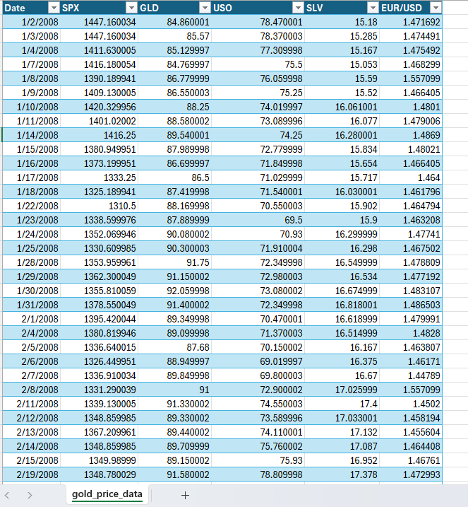

# Data Preparation

## Overview  
This document outlines the data preparation steps performed on the dataset to ensure it is clean, consistent, and ready for analysis. The dataset includes information about gold prices (GLD) alongside other financial indicators such as SPX, USO, SLV, and EUR/USD exchange rates.

---

## Data Examination  
The dataset contains the following columns:  
- **Date**: The date of the recorded data (format: `MM/DD/YYYY`).  
- **SPX**: Standard & Poor's 500 index value.  
- **GLD**: Gold price (in USD).  
- **USO**: United States Oil Fund price.  
- **SLV**: Silver price (in USD).  
- **EUR/USD**: Exchange rate between the Euro and the US Dollar.  

### Sample Data  
Below is a sample of the dataset:  

| Date       | SPX         | GLD      | USO      | SLV      | EUR/USD   |  
|------------|-------------|----------|----------|----------|-----------|  
| 1/2/2008   | 1447.160034 | 84.860001| 78.470001| 15.18    | 1.471692  |  
| 1/3/2008   | 1447.160034 | 85.57    | 78.370003| 15.285   | 1.474491  |  
| 1/4/2008   | 1411.630005 | 85.129997| 77.309998| 15.167   | 1.475492  |  

---

## Data Transformation Steps  
To prepare the data for analysis, the following steps were taken:  

1. **Data Cleaning**:  
   - Checked for missing or null values in all columns.  
   - Ensured all dates were in a consistent format (`MM/DD/YYYY`).  
   - Verified numerical values for outliers or inconsistencies.  

2. **Data Validation**:  
   - Cross-referenced the data with external sources to ensure accuracy.  
   - Identified and corrected any discrepancies in the dataset.  

3. **Data Standardization**:  
   - Converted all numerical values to a consistent decimal format.  
   - Standardized column names for ease of use in analysis.  

4. **Data Enhancement**:  
   - Added derived metrics (e.g., daily changes in gold prices).  
   - Included contextual data (e.g., market events) for deeper analysis.  

5. **Data Export**:  
   - Saved the cleaned dataset in a structured format (CSV).  

---

## Tools Used  
The data preparation process was automated using Python:  
- `pandas` for data manipulation.  
- `numpy` for numerical operations.  
- `matplotlib`/`seaborn` for visualizations (if applicable).  

---

### Sample Data Image  
  

---
