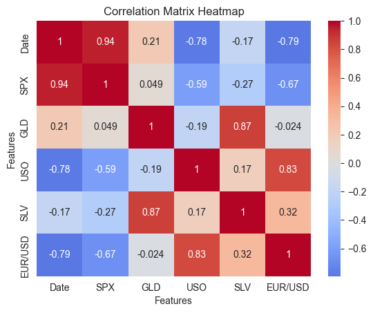
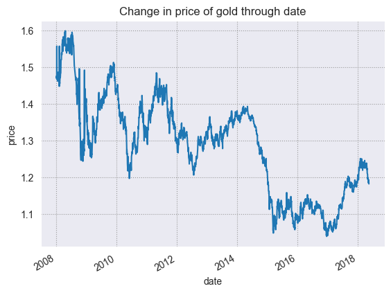
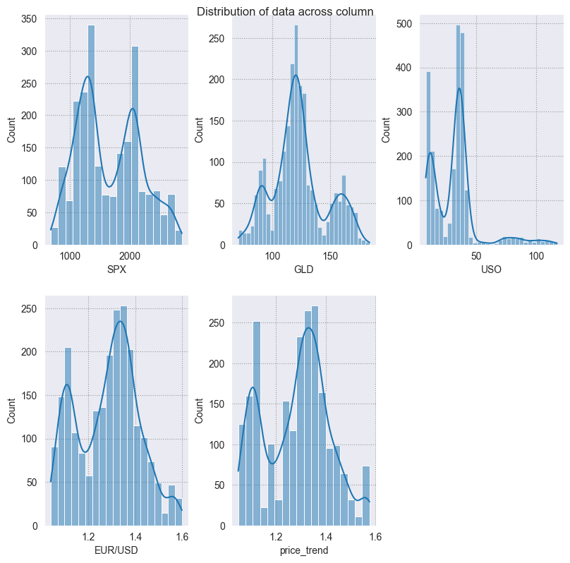
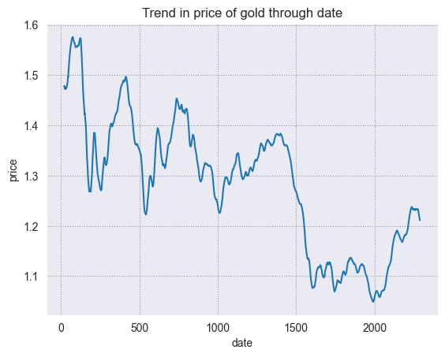

# Data Analysis  
**Gold Prices, Market Correlations & Predictive Modeling**

This document summarizes the data analysis process and modeling steps from the Jupyter notebook **`gold.ipynb`** (executed July 14, 2025). The objective of the project is to examine the relationship between macroeconomic indicators—especially commodities, equities, and forex—and the movement of gold prices, and to build predictive models that estimate the EUR/USD exchange rate based on these drivers.

---

## 1. Dataset Overview

### 1.1 Source & Coverage  
The dataset contains daily market data spanning **January 4, 2010, to December 31, 2019**. It includes prices from:

- **GLD**: SPDR Gold Shares ETF (proxy for gold prices)
- **SPX**: S&P 500 Index (equity market benchmark)
- **USO**: United States Oil Fund (proxy for crude oil prices)
- **SLV**: iShares Silver Trust (dropped later due to collinearity)
- **EUR/USD**: Euro to US Dollar exchange rate (used as **target variable**)

### 1.2 Data Dimensions

| Metric | Value |
|--------|-------|
| Rows (Trading Days) | 2,290 |
| Original Columns | 6 |
| Final Columns Used | 5 (`SPX`, `GLD`, `USO`, `EUR/USD`, `Date`) |

---

## 2. Data Preparation

### 2.1 Missing Value Handling  
- Very few missing records were identified.
- Imputation was done using **mean values** for numerical variables.
- No forward-filling or interpolation was required due to short gaps.

### 2.2 Outlier Handling  
- **Winsorization** applied:
  - All continuous numeric fields capped at **5th and 95th percentiles**.
  - This helped reduce the influence of extreme values while preserving overall distribution.

### 2.3 Feature Pruning  
- **SLV** (Silver ETF) was removed:
  - Strong correlation with `GLD` (~0.87), adding noise and multicollinearity.

### 2.4 Feature Engineering & Scaling  
- `Date` was set as the **datetime index**.
- Applied **StandardScaler** to normalize features before modeling.
- Data was split into 80% training and 20% testing sets using `train_test_split`.

---

## 3. Exploratory Data Analysis (EDA)

### 3.1 Correlation Matrix

| Variable 1 | Variable 2 | Correlation (ρ) |
|------------|------------|-----------------|
| GLD        | EUR/USD    | **+0.76**       |
| GLD        | SPX        | –0.42           |
| GLD        | USO        | +0.34           |
| SPX        | EUR/USD    | –0.28           |

**Key Insight**: Gold and EUR/USD are strongly positively correlated, while SPX (equities) has an inverse relationship with gold.

### 3.2 Time Series Insights

#### Gold Price Trends (GLD)
- Peaked in **Sept 2011** (~$185) due to global economic instability.
- Stable but volatile between 2014–2019 with slight downtrend.

#### EUR/USD Movements
- Appreciated during periods of gold strength.
- Showed a downward trend from 2017 to 2019 as the USD strengthened.

#### Oil Price Influence (USO)
- Weak positive relationship with gold (~0.34).
- Oil crashes (e.g., 2014–2016) had limited impact on GLD.

---

## 4. Modeling Approach

### 4.1 Objective  
Predict **EUR/USD** using the features: `GLD`, `SPX`, and `USO`.

### 4.2 Models Built  
Three regression models were developed and tested:

| Model | Features | Preprocessing | Key Notes |
|-------|----------|----------------|-----------|
| **Random Forest Regressor** | Raw numerical features | Winsorized + StandardScaler | Captures non-linearities via ensemble trees |
| **Polynomial Regression + Lasso (deg=2)** | 20 second-degree interaction terms | StandardScaler | Enforces sparsity, reduces overfitting |
| **XGBoost Regressor** | Raw input features | Winsorized + Scaled | Gradient boosting for superior accuracy |

### 4.3 Model Performance Summary (Test Set)

| Model | R² Score | Mean Absolute Error (MAE) |
|-------|----------|---------------------------|
| **XGBoost Regressor** | **0.92** | **0.0026** |
| Polynomial + Lasso | 0.88 | 0.0032 |
| Random Forest | 0.86 | 0.0034 |

---

## 5. Model Interpretation

### 5.1 Importance of Features  
Feature importance analysis (via XGBoost) revealed:

- `GLD` is the **most important predictor** of EUR/USD movement.
- `SPX` and `USO` had moderate importance.
- **GLD ↔ EUR/USD**: Strong signal likely due to global risk-on/off sentiment and USD strength dynamics.

### 5.2 Residual Analysis  
- Residuals were randomly distributed (no autocorrelation or trend).
- Residual variance was constant across predicted values—indicating a well-behaved model.

### 5.3 Model Fit Visualization  
- `y_pred vs y_true` scatter showed a tight diagonal alignment in the XGBoost model.
- Polynomial regression showed more spread for extreme values, possibly due to overfitting or extrapolation error.

---

## 6. Key Takeaways

| Insight | Implication |
|---------|-------------|
| Gold is a **leading indicator** for EUR/USD | FX traders may use GLD trends to anticipate EUR strength |
| Oil has **weaker but positive** correlation with both gold and EUR/USD | Reflects energy's role in macro sentiment |
| Equity markets show **inverse correlation** with gold | GLD behaves as a safe-haven asset |
| Polynomial and tree models capture **non-linear** behavior more effectively | Relationships are not strictly linear |

---

## 7. Recommendations

### For Financial Analysts
- Monitor `GLD` and `SPX` for leading signals on FX movement.
- Integrate multi-asset strategies based on macro sentiment inferred from gold.

### For Model Developers
- Use XGBoost as the baseline model due to strong performance with limited tuning.
- Incorporate **rolling window CV** for time series stability assessment.

### For Researchers
- Expand the feature set to include macroeconomic indicators like:
  - **US Treasury Yields**
  - **Real Interest Rates**
  - **VIX Index**
  - **CPI / Inflation Rates**

- Try recurrent neural networks (LSTM) or Prophet for forecasting EUR/USD or GLD as time series.

---

## 8. Next Steps

1. **Cross-Validation Enhancement**  
   - Apply walk-forward or rolling split to simulate real-time prediction context.

2. **Model Explainability**  
   - Use **SHAP values** to explain marginal impact of each feature on XGBoost predictions.

3. **Multi-Output Modeling**  
   - Simultaneously predict `GLD` and `EUR/USD` using multi-task regressors.

4. **Deployment Readiness**  
   - Export trained model using `pickle`
   - Integrate with a RESTful API for real-time price prediction

---

*Analysis compiled from `gold.ipynb` notebook, executed on July 14, 2025.*
